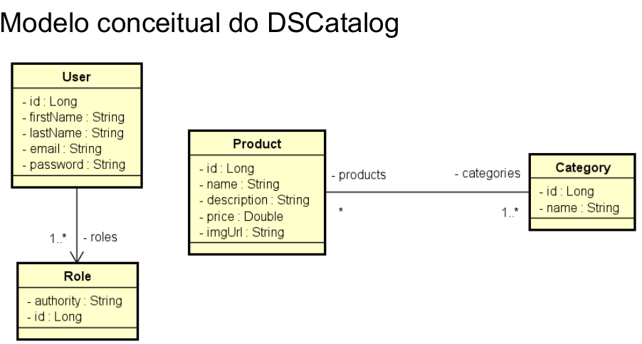

# DSCatalog

Esse é um projeto backend, desenvolvido em java utilizando spring boot na **versão 2.4.4** visando performance para o seu prpósito. A ideia do projeto é criar um sistema simples de catálogo de produtos, onde terá crud de usuários e produtos. Pensando ao longo prazo, apesar deste projeto ser simples, ele conta com as melhores práticas de programação, obedecendo  a modelagem abaixo no qual foi proposto,  respeitando o padrão em camadas e suas responsabilidades e aplicando o princípio de inversão de controle e injeção de dependência por meio do spring framework. 

O projeto também conta com **testes unitários** utilizando mockito, o que dá a flexibilidade de testar cada entidade de forma individual. Além disso, foi implementado **testes de integração** para que o sistema possa ser testado como um todo e claro, tudo isso seguindo as boas práticas bem como o padrão **Arrange**, **Act** & **Assert** para criação, execução das ações e declaração do que deveria acontecer em cada teste.

Pensando em validação, o projeto conta com **bean validation** para que o backend se garanta nas validações da aplicação, como por exemplo: A entidade usuário precisa dos campos **nome** e **e-mail** para cadastro, e aí que entra as constraints **@NotNull** e **@Email** que garante que esses atributos estejam adequados para a consistência e persistência do cadastro do usuário no banco de dados, caso contrário, há um tratamento de exceções para capturar esses possíveis GAPs.

Pensando na segurança, foi implementado o protocolo OAuth2 para autenticação e autorização aos endpoints configurados e como método para geração de token, foi utilizado o padrão JWT que funciona muito bem e é muito utilizado em **Web Services**

O projeto foi dividido em cinco camadas, sendo elas: entidades, repositórios, serviços, objeto de transferência de dados & recursos, tornando a aplicação flexivel e escalável!

Este é um monorepo pensado em separar o backend de uma possível implementação de um frontend, assim aplicando o princípio da escalabilidade.

## Técnologias implementadas

1. Spring Boot: Fornece toda configuração do projeto inicial
2. Spring Data: Fornece uma abordagem consistente para a camada de acesso a dados
3. Spring Framework: Fornece todo o mecanismo de gerenciamento do projeto
4. Spring Security: Fornece o mecanismo para segurança da aplicação
5. Hibernate bean validation: Módulo no qual fornece o esquema de bean validation
6. Mockito: Fornece mecânismo para testes da aplicação
7. H2 Database: É um banco de dados relacional em memória
8. Padrão de Arquitetura em Camadas: Visando produtividade, manutenabilidade e escalabilidade do sistema

